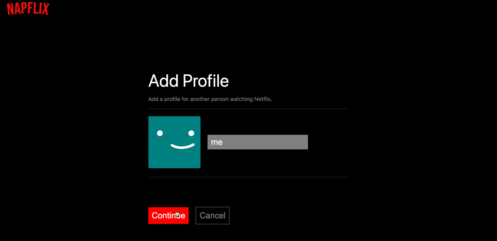
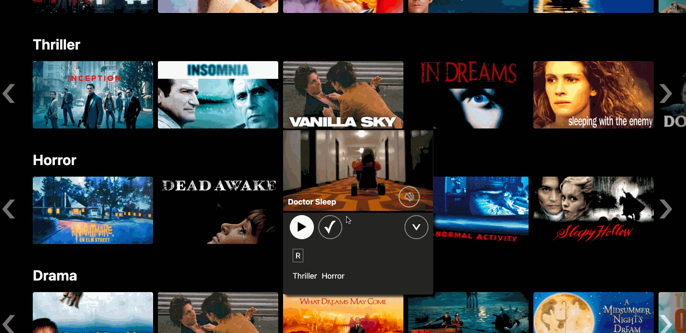
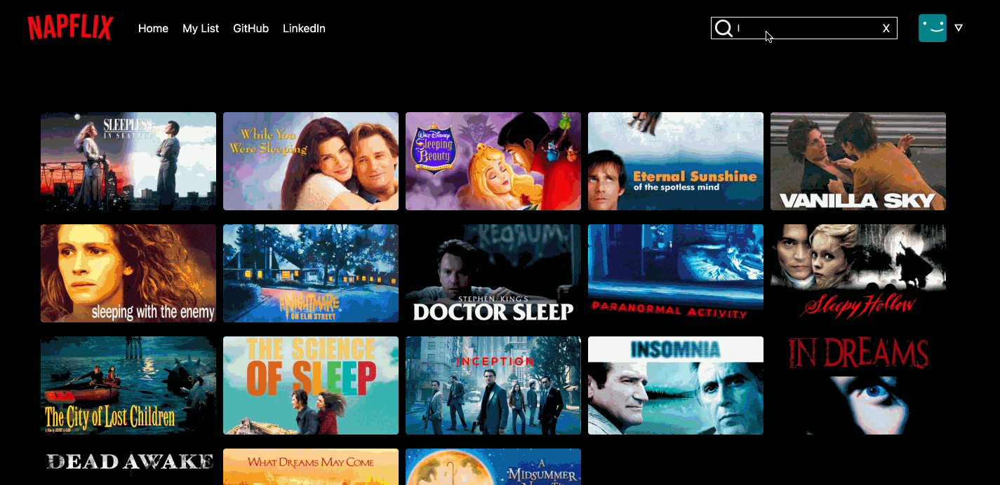

# Napflix

Napflix is a fully-functioning clone of Netflix, consisting entirely of sleep- and dream-themed movie trailers. It was created in just two weeks using the following: 

* Backend: Rails
* Database: PostrgreSQL
* Frontend: React-Redux
* Hosting: Heroku
* Storage: AWS S3

Check out the site [here](http://napflix.herokuapp.com/). 

## MVP Features
### 1. Profiles
As with Netflix, a  Napflix user can create, edit, and delete profiles, allowing multiple people to share a single 'account' and curate their individual My Lists.



### 2. Browse
Upon signing in and selecting a profile, a user is taken to the main movie browse page, on which movies are organized by genre. They can see additional information about each title by hovering over its thumbnail, which also autoplays the associated trailer. From there, the user can play the video in fullscreen, add it to their My List, or click for more information, which opens a larger modal that includes the film's length and summary. 



Allowing a user to scroll horizontally within a given genre list proved more difficult than anticipated, as simply setting overflow: scroll in CSS prevented the movie thumbnails from expanding on hover. I solved this by instead keeping track of the genre list's position in the component's state and shifting it when a user clicks on either the right or left arrows. I also had to shift the arrows themselves to ensure that they remained in place at the edges of the screen.

```javascript
  scrollLeft(e) {
        const lastItem = e.currentTarget.parentElement.lastElementChild.previousElementSibling
        const coord = lastItem.getBoundingClientRect();
        if (window.innerWidth - coord.right >= 20) {
            return false
        } else {
            const leftArrow = document.getElementById('left-arrow');
            const rightArrow = document.getElementById('right-arrow');
            this.setState({xoffset: this.state.xoffset -= this.state.delta});
            this.setState({leftArrow: this.state.leftArrow += this.state.delta});
            this.setState({ rightArrow: this.state.rightArrow -= this.state.delta });
        }
    }
```

### 3. My List
Each profile has a unique My List to help the user keep track of movies they'd like to watch. They can add or delete a given movie from the main browse page or a separate My List page. 


### 4. Search
A search feature within the navigation bar allows a user to find movies by title, genre, or summary keywords. The search is responsive, with results changing as the user types. 



To allow a user to search by title, genre, or summary keyword required multiple functions, each of which returned an array of matches to be stored in state. In the search component's render method, I merged the results, converted them to a set to ensure unique entries, and then rendered each movie.

```javascript
        const movieSet = new Set(this.state.movieMatches.flat().concat(this.state.genreMatches.flat()));
        const displayMovies = Array.from(movieSet);
        const header = (this.state.searchString.length > 0 && displayMovies.length === 0) ?
            `Your search for '${this.state.searchString}' did not have any matches.` : '';
        const display = displayMovies.length ? displayMovies.map(movie =>
            <MovieDetail
                myList={this.props.myList}
                currentProfileId={this.props.currentProfileId}
                createListItem={this.props.createListItem}
                deleteListItem={this.props.deleteListItem}
                key={movie.id}
                movie={movie}
                tags={this.props.tags}
                genres={this.props.genres}
            />
        ) : null;
```


