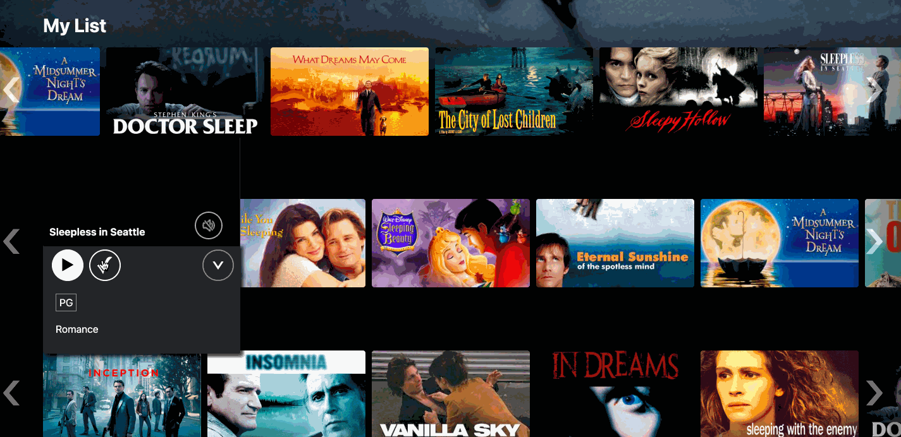

# Napflix

Napflix is a fully-functioning clone of Netflix, consisting entirely of sleep- and dream-themed movie trailers. It was created in just two weeks using the following: 

* Backend: Rails
* Database: PostrgreSQL
* Frontend: React-Redux
* Hosting: Heroku
* Storage: AWS S3

Check out the site [here](http://napflix.herokuapp.com/). 

## MVP Features
### 1. Profiles
As with Netflix, a  Napflix user can create, edit, and delete profiles, allowing multiple people to share a single 'account' and curate their individual My Lists.

### 2. Browse
Upon signing in and selecting a profile, a user is taken to the main movie browse page, on which movies are organized by genre. They can see additional information about each title by hovering over its thumbnail, which also autoplays the associated trailer. From there, the user can play the video in fullscreen, add it to their My List, or click for more information, which opens a larger modal that includes the film's length and summary. 

### 3. My List
Each profile has a unique My List to help the user keep track of movies they'd like to watch. They can add or delete a given movie from the main browse page or a separate My List page. 

### 4. Search
A search feature within the navigation bar allows a user to find movies by title, genre, or summary keywords. The search is responsive, with results changing as the user types. 

